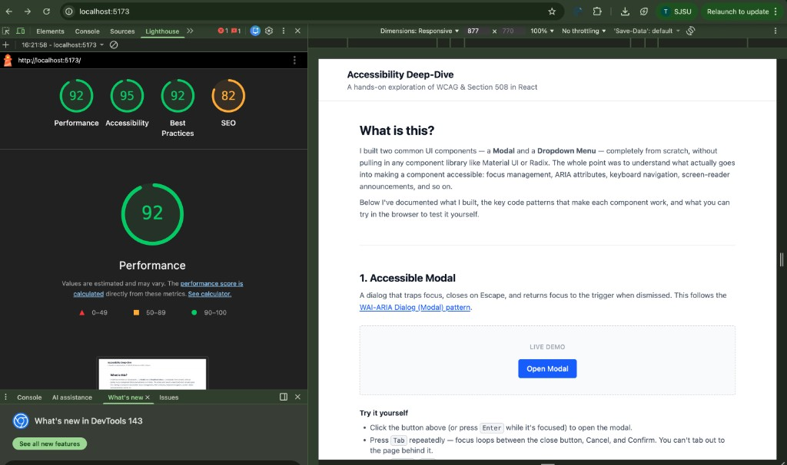
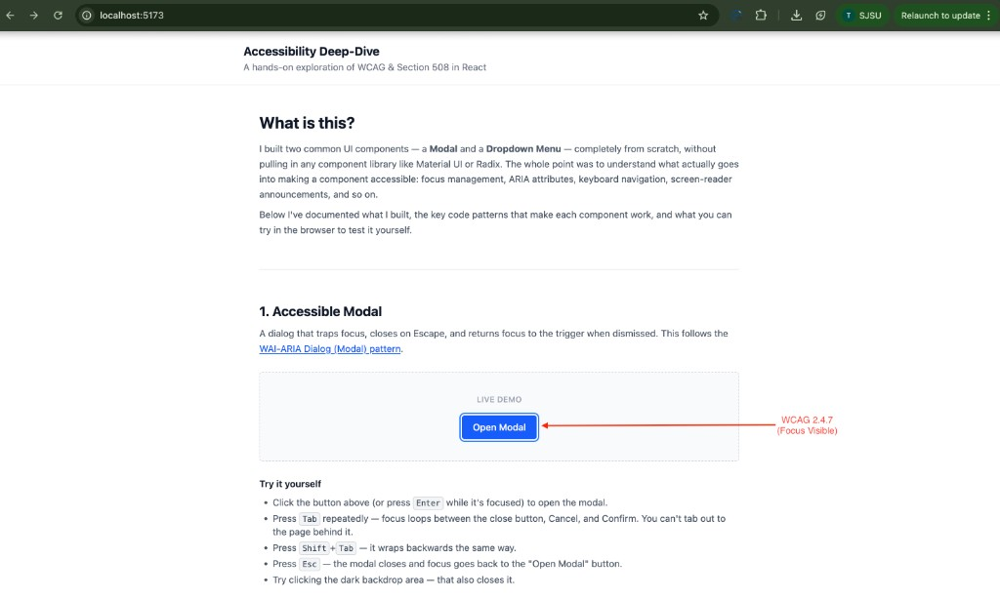

# Accessibility Deep-Dive — Custom Modal & Dropdown

A hands-on learning project where I built two common UI components — a **Modal** and a **Dropdown Menu** — entirely from scratch in React, without relying on any pre-built component library (no Material UI, no Radix, no Headless UI).

The goal was to understand what actually goes into making a component accessible at the code level: focus trapping, ARIA roles, keyboard navigation, screen-reader announcements, and Section 508 compliance. Instead of just importing a library that handles all of this behind the scenes, I wanted to write every line myself so I could see _why_ each pattern exists.

## Screenshots

### Lighthouse Scores


### Focus Visible Demo (WCAG 2.4.7)


## What I Built

### Accessible Modal (`<Modal />`)
- **Focus trapping** — Tab and Shift+Tab cycle through elements inside the dialog only; focus never leaks to the page behind it.
- **Escape to close** — Pressing Esc dismisses the modal instantly.
- **Focus restoration** — When the modal closes, focus returns to the button that opened it so the user doesn't lose their place.
- **ARIA roles** — `role="dialog"`, `aria-modal="true"`, and `aria-labelledby` pointing to the dialog title.
- **Scroll lock** — Background scrolling is disabled while the modal is open.

### Accessible Dropdown (`<Dropdown />`)
- **Keyboard toggle** — Enter, Space, and ArrowDown open the menu; ArrowUp opens with the last item focused.
- **Arrow navigation** — ArrowUp/ArrowDown move through items cyclically. Home/End jump to first/last.
- **Roving tabindex** — Only the active item has `tabIndex=0`; all others have `-1`. This is what makes screen readers announce each item as you navigate.
- **ARIA attributes** — `aria-haspopup="true"`, `aria-expanded`, `role="menu"`, and `role="menuitem"`.
- **High-contrast focus ring** — The active item gets a visible blue ring so sighted keyboard users can always see where they are.

## Why I Built It This Way

Most tutorials either (a) use a component library and call it a day, or (b) explain ARIA attributes in theory without showing the actual focus-management code that makes them work. I wanted to bridge that gap — build real components, annotate the code with what I learned, and create a page where anyone can test the keyboard behavior themselves.

The showcase page includes:
- Live interactive demos for each component
- "Try it yourself" checklists (e.g., "Press Tab — focus loops inside the modal")
- Code snippets showing the key patterns (focus trap logic, roving tabindex, cyclic wrapping)
- A "What I Learned" section with my takeaways
- Links to the WAI-ARIA specs and resources I referenced

## Tech Stack

- **React 19** — functional components with hooks (`useRef`, `useEffect`, `useCallback`)
- **Vite** — fast dev server and build tool
- **Tailwind CSS v4** — utility-first styling, focus-visible ring utilities for accessible focus states

Zero UI library dependencies. Everything is hand-written.

## Getting Started

```bash
npm install
npm run dev
```

Open [http://localhost:5173](http://localhost:5173) and try navigating the page using only your keyboard.

## Accessibility Standards Referenced

- [WCAG 2.1 Level AA](https://www.w3.org/WAI/WCAG21/quickref/) — color contrast, focus visible, keyboard operable
- [WAI-ARIA Authoring Practices Guide](https://www.w3.org/WAI/ARIA/apg/) — Dialog (Modal) pattern, Menu Button pattern
- [Section 508](https://www.section508.gov/) — U.S. federal accessibility requirements
